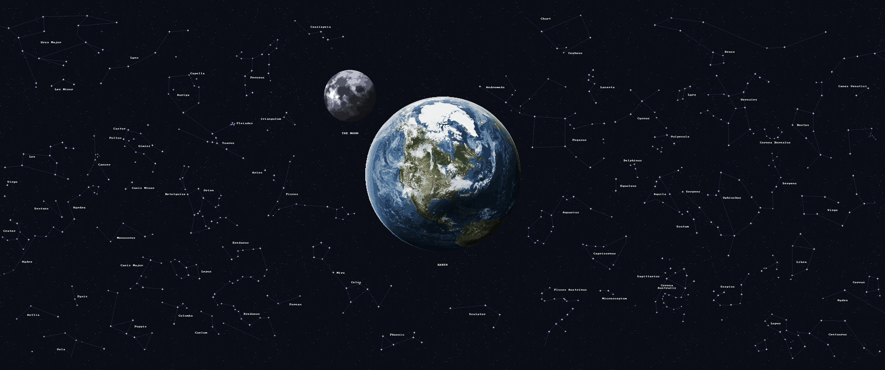

  

  <h1>👋 Hi! I'm Nakhalan Atqiya Arifin Putra (Khalan)</h1>
  <h3>Full-Stack Web Developer Enthusiast & Aspiring Game Studio Founder</h3>

  

    
    
  

---

### 👨‍💻 About Me
- 🎓 Currently deepening my knowledge in **Web Programming** and **Game Development**.
- 🏆 **Achievements:** Unity Certified Associate in Game Development (2025) & Global Game Jam 2025 Participant.
- 💻 **Currently Exploring:** Building interactive web portfolios with **React & Firebase**, and experimenting with 3D environment shaders in **Unity**.
- 🎯 **Goals:** Become a Full-Stack Web Developer and establish my own Game Studio.
- 💬 **Let's talk about:** Web Development, Game Design, Anime stuff, and Music!

---

### 🛠️ Tech Stack & Tools

**Web Development** 

 

**Game Development & Languages** 

 

**Database** 

---

### 📊 GitHub Stats

  
    
  
    
  

